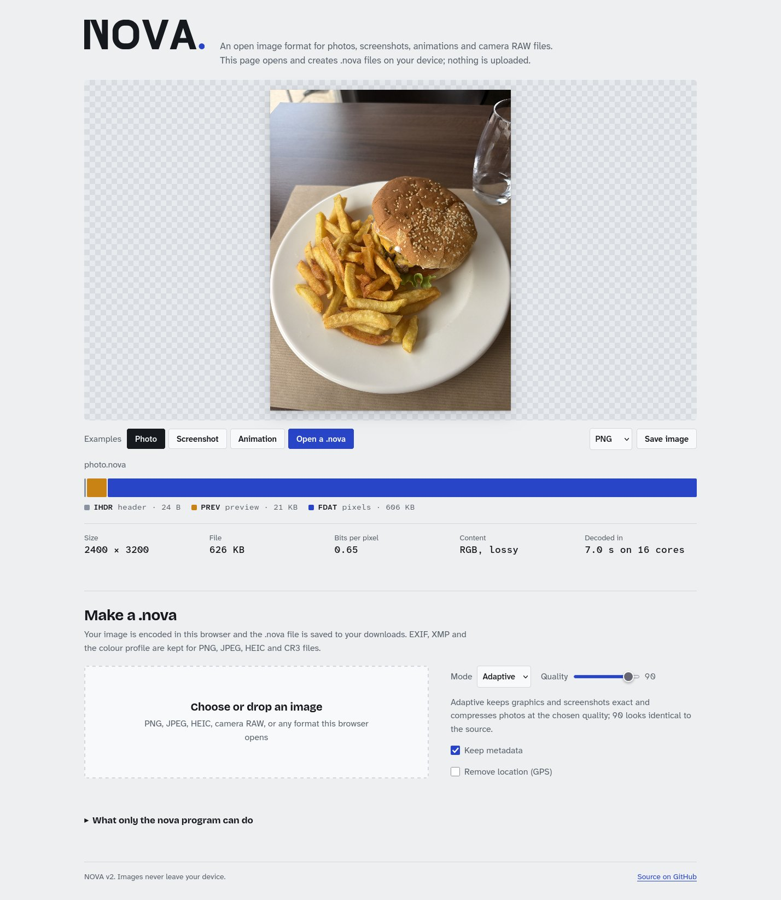

<div align="center">

# NOVA

**One image format for photos, screenshots, animations and camera RAW files.**<br>
Half the size of PNG and usually smaller than WebP when every pixel must stay exact, on par with AVIF when it need not.

[](https://thibault-savenkoff.github.io/nova/)
[](#status)
[](https://lisaac.org)
[](LICENSE)

<a href="https://thibault-savenkoff.github.io/nova/"></a>

</div>

## Status

This is the `v2` branch: NOVA rewritten from scratch in [Lisaac Ω](https://lisaac.org), with its own codec.
NOVA v1, on `main`, is a Python container around PNG and JPEG data. v2 replaces it on `main` once it is finished.
v1 and v2 files are not compatible. The web page linked here is still v1 until v2 reaches `main`.

## Numbers

**Lossless.** Every pixel comes back exactly. Sizes against PNG (optimised) and WebP lossless (method 6):

| Image | NOVA vs PNG | NOVA vs WebP |
| --- | --- | --- |
| Photos, 12–24 Mpx (10 photos) | **50 %** on average (45–63 %) | **84 %** on average (80–99 %) |
| iPhone screenshots (2) | 42 % | 86–87 % |
| Terminal screenshot, 1920 × 1080 | 32 % | 100.6 % (WebP wins by 356 bytes) |
| Synthetic text, gradient, alpha | 15–73 % | 82–98 % |
| Pure noise (nothing to compress) | 100 % | 100 % |

**Lossy.** Same quality as the other formats (PSNR / SSIM), three photo crops:

| Against | Size of the NOVA file |
| --- | --- |
| WebP | **69 %** (PSNR), 80 % (SSIM) |
| AVIF | 100 % (PSNR), 108 % (SSIM) |
| HEIC | 100 % (PSNR), 104 % (SSIM) |

**Camera RAW.** The sensor data of a Canon CR3 is kept bit for bit in 80–85 % of the CR3's size.

Measured with `test/check.sh` and `test/rd_summary.sh`. The photos themselves are not in the repository.

## Try it

**In your browser:** [thibault-savenkoff.github.io/nova](https://thibault-savenkoff.github.io/nova/) opens and creates `.nova` files.
It runs NOVA compiled to WebAssembly on your device; nothing is uploaded. It works on phones too (tested on an iPhone 17 Pro Max).

**On the command line:**

```sh
nova encode photo.heic photo.nova            # adaptive: exact for graphics, wavelet q 90 for photos
nova encode shot.png shot.nova -m lossless   # always exact
nova encode frame*.png anim.nova -d 40       # several sources make an animation
nova encode IMG_1401.CR3 IMG_1401.nova       # camera RAW, sensor frame kept exactly

nova decode photo.nova photo.jpg -q 90       # also .png .tif .webp .avif .heic
nova decode IMG_1401.nova IMG_1401.dng       # RAW back to DNG, or developed to .png .tif .jpg
nova preview photo.nova thumb.png            # the embedded 512 px thumbnail, instantly
nova info photo.nova                         # the chunks of the file
```

EXIF (GPS included), XMP and the colour profile of the source are kept. Run `nova` with no arguments for every option.

## What's inside

| | |
| --- | --- |
| **Lossless codec** | Context mixing, as in paq and GraLIC: several models predict each bit and a logistic mixer blends them. Levels 0–4 trade time for size, from palette coding to blended predictors. |
| **Lossy codec** | A wavelet codec (level 5), picked automatically for photos in adaptive mode. Quality 90 is about 45 dB: it looks identical to the source. |
| **RAW** | Level 6 codes the camera's sensor frame exactly and keeps what LibRaw needs to develop it, so a `.nova` goes back to DNG or develops with the camera's look. |
| **Animation** | Frames after the first store only the rectangle that changed. |
| **Speed** | Images are coded in independent stripes and decoded on every core, in the program and in the browser. |
| **Container** | PNG-like chunks: `IHDR` header, `PREV` thumbnail first so viewers show something at once, `FDAT`/`FDLT` frames, `MDAT` metadata, `LIVE` Live Photo video. Unknown chunks are skipped. |

## Build

You need the [Lisaac Ω](https://lisaac.org) compiler (0.6) and GCC.

```sh
lisaac nova.li -boost      # writes ./nova (and nova.c)
```

HEIC/AVIF, WebP and RAW support load their libraries at run time, so `nova` builds without them and uses them when they are installed:
[libheif](https://github.com/strukturag/libheif), [libwebp](https://chromium.googlesource.com/webm/libwebp) and [LibRaw](https://www.libraw.org) 0.22.

The web version is built with [Emscripten](https://emscripten.org): `docs/build.sh` compiles `nova.c` and LibRaw to `docs/nova_enc.wasm`.

## Tests

Each test compares NOVA with a reference, byte for byte or pixel for pixel:

```sh
test/check.sh     # lossless round trip of every image, with the size table
test/js.sh        # the JavaScript decoder against the program
test/replicas.sh  # the multi-core WebAssembly build against the program
test/raw.sh       # RAW: sensor frame, DNG and developed images against LibRaw
```

`test/corpus/` holds small synthetic images. The photo tests read your own photos (`test/photos/`, not published).

## FAQ

**Why Lisaac Ω?**
It is a prototype-based language, compiled to C: the first compiled one. NOVA v2 is also a test of how far it goes on real work: a codec, a container, six output formats and a WebAssembly build.

**Can the browser version open HEIC files?**
In Safari only, which decodes HEIC itself. Other browsers do not ship an HEVC decoder, and this site does not either.

**What does the browser version leave out?**
Animations and Live Photos are created with the program only, and export is limited to PNG, JPEG and WebP. The page lists the rest.

## Credits

- [LibRaw](https://www.libraw.org) (LGPL 2.1 or CDDL 1.0) reads and develops camera RAW files. Its headers are in `third_party/libraw/`, and the web version (`docs/nova_enc.wasm`) contains it.
- [libwebp](https://chromium.googlesource.com/webm/libwebp) (BSD) writes WebP. Its headers are in `third_party/libwebp/`.
- The site uses [Bricolage Grotesque](https://github.com/ateliertriay/bricolage) and [Atkinson Hyperlegible](https://www.brailleinstitute.org/freefont/) (SIL Open Font License, in `docs/fonts/`).

## License

[MIT](LICENSE). Third-party code keeps its own license, see [Credits](#credits).
